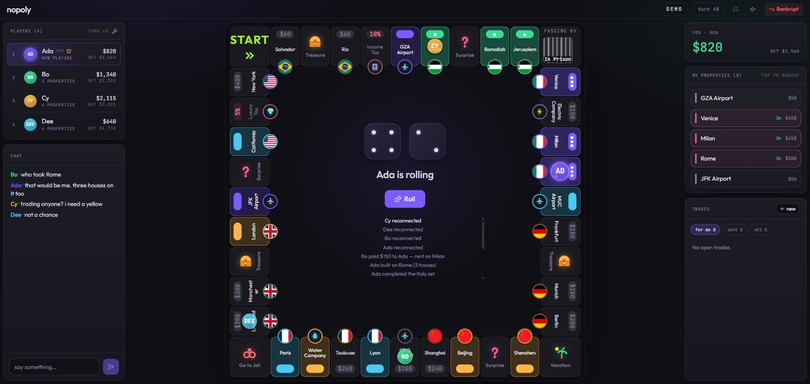
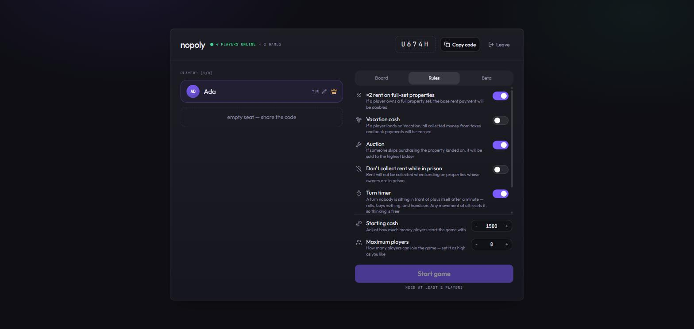

# nopoly

Two real-time multiplayer games for a private friend group, sharing one server:
**nopoly**, a property-trading board game, and **nouno**, a shedding card game.
No player caps, no paywalls, no ads.



Inspired by [richup.io](https://richup.io). Not affiliated with, endorsed by, or
derived from Hasbro's Monopoly — the board layouts, rules, and artwork here are
original.

## What it does

Both games share everything that isn't the rules: room codes, reconnecting into
your seat, presence, chat, kick, spectating, the turn clock, snapshots, past
games and share links. Which game a room is playing is picked when it is made.

### nopoly — the board

- **Three boards**, swappable in the lobby, and adding another is adding one file
- **The full game** — buy, rent, colour sets, houses and hotels, jail, cards,
  auctions, trades, bankruptcy
- **Teams (beta)** — up to eight sides of any size, set in the lobby, sharing
  property and monopolies but keeping separate balances, with interleaved turns
  and a prompt to bail out a teammate who can't cover a debt
- **Reconnect into your seat** after a refresh or a dropped connection, with a
  grace period before the table skips you
- **Spectating** — watch a game in progress, or a game you're out of
- **Vote-kick**, and an abandonment countdown for someone who has already gone
- **A turn clock** that plays a turn nobody is sitting in front of, measured
  from your last sign of life rather than from the start of the turn
- **Live update** — clients notice a new build and reload themselves onto it
- **Persistence** — games survive a server restart
- **Synthesised audio**, including sounds for what *other* people do, with a
  bench at `/sounds.html`
- **End-of-game stats**, with net worth charted over the whole game

### nouno — the cards

- **A hundred and eight cards** in four suits: numbers, Halt, Turn, Plus Two,
  and the two wilds. Classic counts, our own names and artwork
- **Your hand is yours** — the state the room is sent carries how many cards
  everyone holds and never what they are; the cards themselves go down a
  private channel to one person
- **A table you sit at**, with everyone else round the far side of it and your
  own hand fanned in front of you
- **Last card** to call before you play your second-to-last one, or draw two
  for the silence
- Everything above it inherits: reconnect, spectate, kick, the turn clock
  (which draws and passes for anyone who has gone quiet), past games and share
  links



## Stack

**Client** — React 19, Vite, Tailwind v4, shadcn (Base UI), Framer Motion,
Recharts
**Server** — Node, Express 5, Socket.IO 4

The server is authoritative: the rules live in `server/game/` and
`server/index.js` only wires sockets to them and broadcasts the resulting
state. Clients render what they're told and never decide an outcome themselves.

A room carries which game it is playing, and a rules module owns the handful of
things a game cannot share — what a fresh room holds, what a player carries,
what starting means, what the turn clock does for someone who has gone quiet,
what happens to a player who is removed, and which slice of the state the
client is sent. `server/game/rules.js` is the registry; everything else in
`engine.js` is common ground.

Game state is held **in memory** — there is no database, so the server cannot
run as more than one process. That is a deliberate trade rather than an
oversight; [`ARCHITECTURE.md`](ARCHITECTURE.md) explains it and the rest of the
reasoning.

## Running locally

Two terminals:

```bash
cd server && npm install && npm run dev     # :3000
cd client && npm install && npm run dev     # :5173
```

Set `NOPOLY_PASSWORD` to require a password; leave it unset and the server runs
open, which is convenient locally. In production an open server has to be asked
for explicitly with `NOPOLY_OPEN=1`, so an unset password fails loudly instead
of quietly publishing the site.

## Tests

```bash
cd server && npm test        # 33 suites
npm test idle                # only suites matching "idle"
```

Engine suites need nothing; the socket suites get a server booted for them.

## Deploying

See [`deploy/README.md`](deploy/README.md). One VM runs everything — Node serves
both the API and the built client, with Nginx terminating TLS in front.

The game cannot run on serverless hosting: state lives in one process's memory,
so there is nowhere for a second instance to look. `vercel.json` is a reverse
proxy only, giving the same VM a second hostname for networks where the first
one is filtered.

## Documentation

| | |
|---|---|
| [`ARCHITECTURE.md`](ARCHITECTURE.md) | How it's built and why |
| [`deploy/README.md`](deploy/README.md) | Standing it up on a free Oracle Cloud VM |
| [`client/legal.html`](client/legal.html) | Terms and privacy, served at `/legal.html` |

If you deploy your own copy, `client/legal.html` names a contact address and
points at Australian law — change both, or drop the page. It also states what is
stored and for how long, so it needs editing whenever that changes.
